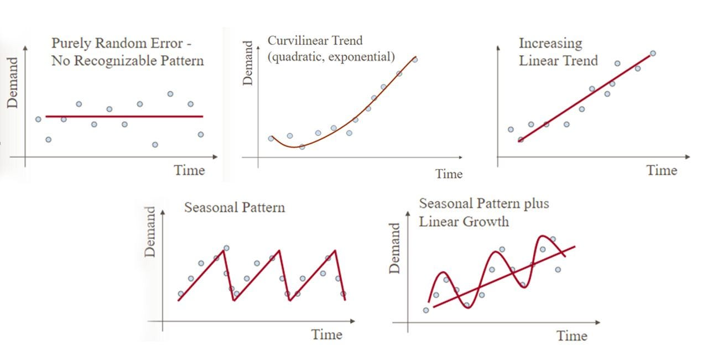
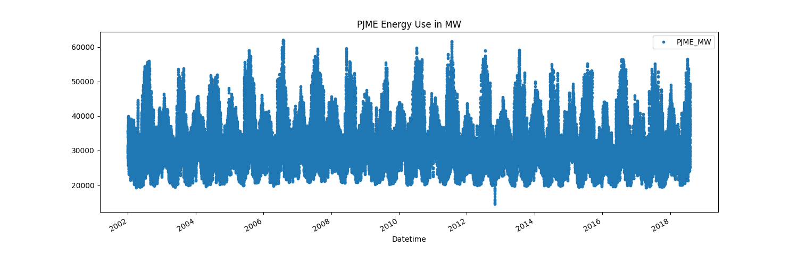
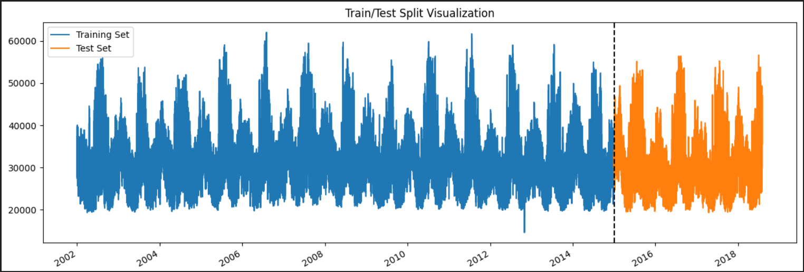

# Energy Consumption Time Series Prediction using XGBoost

This project focuses on predicting energy consumption using the powerful XGBoost algorithm. Accurately forecasting energy consumption is crucial for efficient resource allocation, demand planning, and sustainable energy management in various domains, including residential, commercial, and industrial sectors.

## Introduction

In this project, we leverage XGBoost, a popular gradient boosting technique renowned for its excellent performance in handling time series data. By combining decision trees and boosting techniques, XGBoost provides highly accurate predictions and robust feature selection capabilities.

The primary objective of this project is to develop a reliable model that can predict future energy consumption based on historical data. By analyzing and understanding the underlying patterns and trends in the energy consumption time series, we aim to build a predictive model capable of capturing complex dependencies and variations.

## Project Highlights

- Implementation of the energy consumption prediction pipeline using XGBoost.
- Clear and well-documented code available in this GitHub repository.
- Detailed explanations accompanying the code to aid understanding.
- Inclusion of relevant visualizations and insights gained from the analysis.

## Types of Time Series Data Analysis

During the course of this project, we consider the following types of time series data analysis:

1. **Purely Random Error - No Recognizable Pattern**

   This type of time series data is characterized by random fluctuations or noise without any discernible pattern. It indicates that the energy consumption values are randomly distributed around a mean value without any significant trends or dependencies.

2. **Curvilinear Trend (quadratic, exponential)**

   Curvilinear trends in time series data exhibit a nonlinear relationship between the time variable and energy consumption. It can take different forms, such as quadratic or exponential growth/decay. Understanding the curvilinear trend helps capture the nonlinear behavior and make more accurate predictions.

3. **Increasing Linear Trend**

   An increasing linear trend indicates a consistent and steady rise in energy consumption over time. It suggests a linear relationship where energy consumption increases at a constant rate. Identifying this trend helps predict future energy consumption based on the linear growth pattern.

4. **Seasonal Pattern**

   Seasonal patterns refer to regular and predictable fluctuations in energy consumption that occur within a specific time frame. For example, energy consumption might follow a yearly, monthly, or weekly cycle. Analyzing seasonal patterns helps identify recurring patterns and adjust predictions accordingly.

5. **Seasonal Pattern Plus Linear Growth**

   This type of time series data combines both seasonal patterns and a linear growth component. It implies that energy consumption exhibits regular fluctuations while gradually increasing or decreasing over time. Modeling both the seasonal pattern and the linear growth allows for capturing more complex variations in energy consumption.

These different types of time series data analysis enable us to gain insights into the underlying patterns and trends in energy consumption. By considering and addressing these variations, we can build accurate predictive models using the powerful XGBoost algorithm.

## Dataset

The dataset used in this project was obtained from Kaggle. It consists of the following two features:

1. **PJME_MW**: This feature represents the energy consumption in megawatts (MW). It provides the primary data for our analysis and prediction.

2. **Datetime**: This feature represents the timestamp or date and time associated with each energy consumption measurement. It allows us to analyze the energy consumption patterns over time.

## Data Visualization

To facilitate data visualization, we utilized the `to_datetime` function from the pandas library. This function allows us to convert the datetime strings in the dataset into datetime objects, enabling easier manipulation and plotting of the data.

Visualization plays a crucial role in understanding the underlying patterns and trends in the dataset. It helps us gain insights into the relationships between the features and identify any significant temporal variations in energy consumption.

By effectively visualizing the dataset, we can make informed decisions and develop accurate models for energy consumption time series prediction.

## Train-Test Split

To assess the performance and accuracy of our predictive model, we divide the dataset into two subsets: the training dataset and the test dataset. The split is based on the following criterion:

- All data points before 1st Jan 2015 are included in the training dataset.
- All data points after 1st Jan 2015 are included in the test dataset.

By separating the data in this way, we ensure that our model is trained on historical observations and evaluated on future unseen data. This split allows us to simulate real-world scenarios where the model predicts energy consumption on new and unknown data.

## Data Visualization

Visualizing the train-test split can help us understand the distribution of the data and the separation between the training and test sets. This visualization aids in assessing the temporal order and ensuring that the split aligns with our intended division of the dataset.

By visually inspecting the train-test split, we can verify that the division accurately represents the temporal sequence of the data and enables reliable evaluation of our predictive model's performance.

